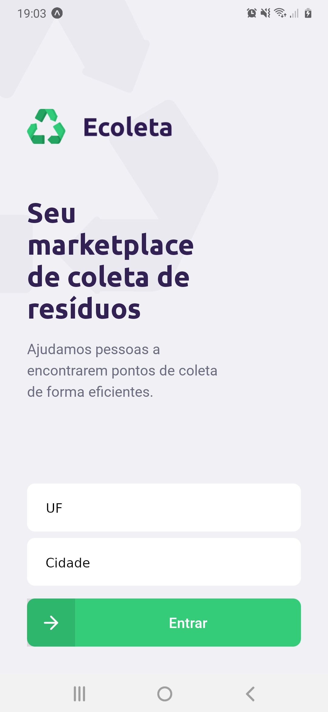
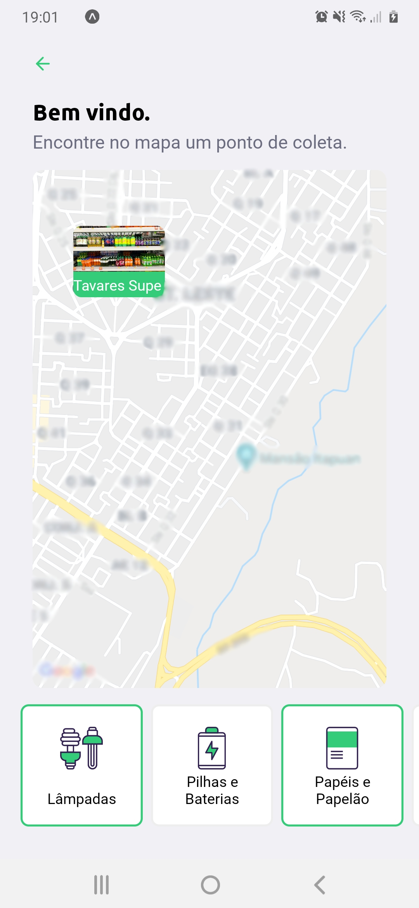
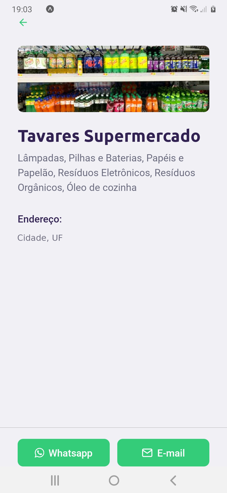

<p align="center">
  
</p>

# :rocket: Next Level Week
NLW is a practical week with lots of code, challenges, networking and a single objective: to take you to the next level. Through our method you will learn new tools, learn about new technologies and discover hacks that will boost your career. An online and completely free event that will help you take the next step in your evolution as a dev.

# :recycle: Ecoleta

Ecoleta is a cross platform based on International Environment Week created to connect people to companies that collect specific waste sush as light bulbs, batteries, cooking oil etc.

<p align="center">
  
</p>


## :bulb: Getting Start

### Technologies

* [Typescript](https://www.typescriptlang.org/)
* [Node.js](https://nodejs.org/en/)
* [React](https://reactjs.org/)
* [React Native](https://reactnative.dev/)
* [Expo](https://expo.io/)

### Prerequisites

* [Git](https://git-scm.com/)
* [Node.js](https://nodejs.org/en/)
* [Yarn](https://yarnpkg.com/) (optional)

### Installation

1. API (Backend)
  ```
  # Clone repository backend-nlw
  $ git clone https://github.com/victor4pinheiro/backend-nlw

  # Go into the repository
  $ cd backend-nlw

  # Install dependencies
  $ npm install / yarn install

  # Run Migrates
  $ npm run knex:migrate / yarn knex:migrate

  # Run Seeds
  $ npm run knex:seed / yarn knex:seed

  # Start server
  $ npm run dev / yarn dev

  # running on port 3333
  ```

2. Frontend
  ```
  # Clone repository web-nlw
  $ git clone https://github.com/victor4pinheiro/web-nlw

  # Go into the repository
  $ cd web-nlw

  # Install dependencies
  $ npm install

  # Run
  $ yarn start

  # running on port 3000
  ```
3. Mobile

<p align="center">
  
  
  
</p>

  ```
  # Clone repository mobile-nlw
  $ git clone https://github.com/victor4pinheiro/web-nlw

  # Go into the repository
  $ cd mobile-nlw

  # Install dependencies
  $ npm install / yarn install

  # Run
  $ npm start / yarn start

  # Expo will open, just scan the qrcode on terminal or expo page

  # If some problem with fonts, execute:
  $ expo install expo-font @expo-google-fonts/ubuntu @expo-google-fonts/roboto

  # If some problem with expo, stop script using Ctrl + C and restart using npm start
  ```

# License

This project is under the MIT license. See the LICENSE for details.

[LICENSE](LICENSE)

Made first time with ♥ by [Victor Pinheiro](https://www.linkedin.com/in/victor-4-pinheiro/)